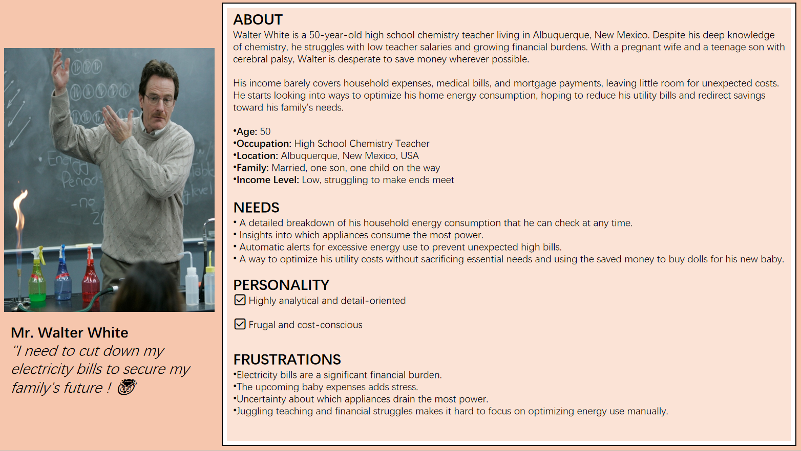
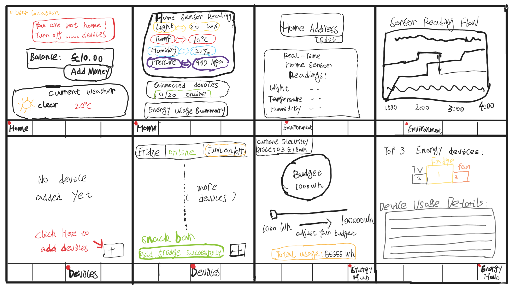

<!-- 

 -->

  

======================================================================================================================================
# Project Description: 
**WiseWatts** is a Flutter-based mobile application platform📱designed for smart house appliance🏠and energy management⚡. It combines multiple functionalities, including home environment monitoring, remote control of appliances, power budgeting, and visualised energy data analysis, with the goal of assisting users in achieving more efficient, eco-friendly, and personalized energy consumption strategies. By leveraging Firebase cloud services, IoT devices (e.g., ESP32), and real-time chart rendering, WiseWatts delivers an intelligent user experience characterized by high operability, an intuitive interface, and prompt feedback.

**It consists of four core pages**, namely the Home Page, the Environment Page, the Devices Page and the Energy Hub Page. These pages have been functionally divided based on the key requirements of smart home energy management, and they work collaboratively to jointly build a comprehensive platform with a clear structure and complementary functions.

======================================================================================================================================
# 1. User Persona:

======================================================================================================================================
# 2. Paper Prototyping:

======================================================================================================================================
# 3. Screens:
**Home Page**:

======================================================================================================================================

Having Contact Details is also good as it shows people how to get in contact with you if they'd like to contribute to the app. 
