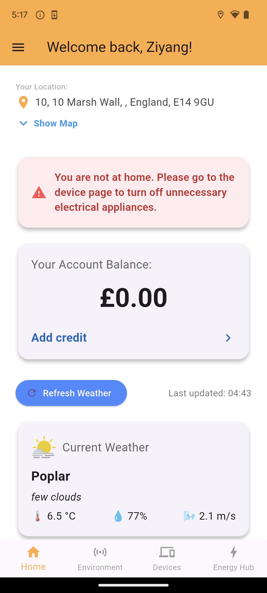
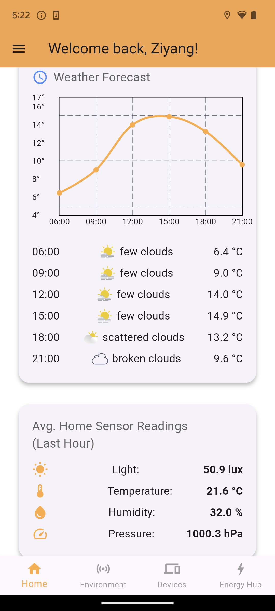
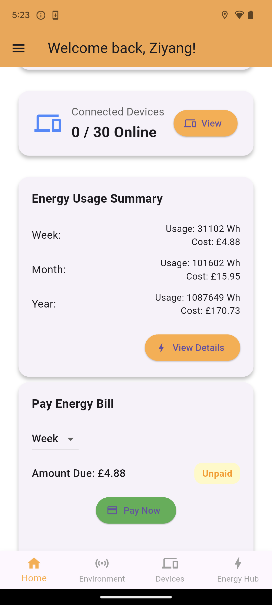

<!-- 

 -->

  

======================================================================================================================================
# Project Description: 
**WiseWatts** is a Flutter-based mobile application platform📱designed for smart house appliance🏠and energy management⚡. It combines multiple functionalities, including home environment monitoring, remote control of appliances, power budgeting, and visualised energy data analysis, with the goal of assisting users in achieving more efficient, eco-friendly, and personalized energy consumption strategies. By leveraging Firebase cloud services, IoT devices (e.g., ESP32), and real-time chart rendering, WiseWatts delivers an intelligent user experience characterized by high operability, an intuitive interface, and prompt feedback.

**It consists of four core pages**, namely the Home Page, the Environment Page, the Devices Page and the Energy Hub Page. These pages have been functionally divided based on the key requirements of smart home energy management, and they work collaboratively to jointly build a comprehensive platform with a clear structure and complementary functions.

======================================================================================================================================
# 1. User Persona:

======================================================================================================================================
# 2. Paper Prototyping:

======================================================================================================================================
# 3. Screens:
**3.1.Home Page**: 
The homepage screen of WiseWatts provides users with a one-stop overview for household energy management. The page features multiple key functions presented in a card-style layout, integrating map positioning, weather information, connected environment status, household appliance on/off status, and energy consumption overview to enable users to comprehensively monitor their home's energy status. Below are the specific functionalities:  

**Account Balance Display:** Real-time retrieval and display of each user's account balance information stored dedicated Firestore Database, supporting subsequent balance top-up and energy bill payments.  

**Current Location and Home Address Map:** Utilizes the Google Maps API and on-board GPS to detect the user’s current location alongside the set home address, enable app to remind users to turn off unnecessary household appliances when they are not at home.

**Weather Information Card:** Integrates the Google Weather API to present current and forecasted weather conditions, aiding users in optimizing energy usage strategies based on external climate factors.  

**Sensor Average Value Card:** Reads the latest 60 environmental data value (lighting, temperature, humidity, and air pressure) collected by Environment Page, calculates their average values and display, aiding users in optimizing energy usage strategies based on internal connected environment factors.  

**Device Overview Card:** Displays the total number of added devices and the count of online devices, allowing navigation to the device management page for further operations.  

**Energy Overview Card:** Retrieves briefly information (stored in Firestore Database) of weekly/monthly/annually household electricity consumption and money cost, enabling users to quickly understand their energy usage while providing access to the Energy Hub Page for detailed analysis.   

**Pay Energy Bill Card:** Provide users with a convenient entry point for energy bill payment, while also supporting users' independent selection of payment cycles.

The overall design prioritizes data accessibility and information integration. All content is automatically loaded upon program startup and remains synchronized in real-time with Firebase, delivering an intuitive, clear, and user-friendly experience.  

  
  
  
  

======================================================================================================================================

# Contact Details:
If you have any question❓or suggestion❗for WiseWatts⚡, feel free to contact me via email ucabzd3@ucl.ac.uk ! 😀

My working time is: 10:00 a.m. to 5:00 p.m. Monday - Friday.

Looking Forward to receving your feedback ！ 🧐

Ziyang Deng

MSc Systems Engineering for the Internet of Things

Department of Computer Science, UCL
