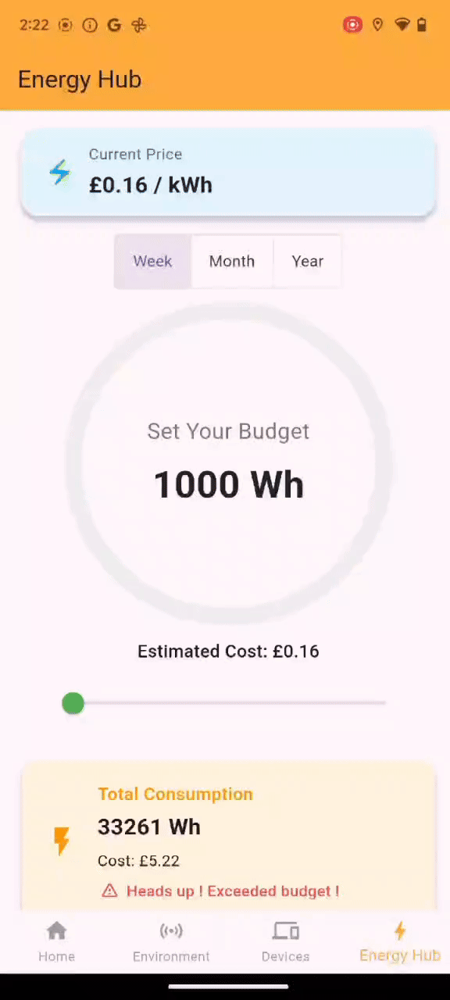

<!-- <p align="center"></p> -->
<p align="center">
  
</p>


=========================================================================================
Link to this Repository: https://github.com/dzy0803/Ziyang-Mobile-WiseWatts

Landing page: https://dzy0803.github.io/wisewattslandingpage/

# Project Description: 
**WiseWatts** is a Flutter-based mobile application platform📱designed for smart house appliance🏠and energy management⚡. It combines multiple functionalities, including home environment monitoring, remote control of appliances, power budgeting, and visualised energy data analysis, with the goal of assisting users in achieving more efficient, eco-friendly, and personalized energy consumption strategies. By leveraging Firebase cloud services, IoT devices (e.g., ESP32), and real-time chart rendering, WiseWatts delivers an intelligent user experience characterized by high operability, an intuitive interface, and prompt feedback.

**It consists of four core pages**, namely the Home Page, the Environment Page, the Devices Page and the Energy Hub Page. These pages have been functionally divided based on the key requirements of smart home energy management, and they work collaboratively to jointly build a comprehensive platform with a clear structure and complementary functions.

=========================================================================================
# 1. User Persona:
To better align with the actual usage scenarios and needs of users, we have created a concrete user persona - Walter White😎(from TV play series《Breaking Bad》). He represents family users who are under pressure from energy expenses, concerned about family financial planning, and hope to optimize their living costs through intelligent means. By depicting his background, motivations, behavioral characteristics, and pain points, we can continuously align with the concerns of real users during the product design process and ensure that the solutions are both practical and emotionally resonant.


=========================================================================================
# 2. Paper Prototyping:
In the early stage of product design, we adopted the method of paper prototyping to initially conceive and visually express the core page structure and interaction flow of the WiseWatts application. By rapidly iterating the interface layout and user paths through hand-drawing, it not only helped to validate the design ideas at a low cost but also provided an intuitive and clear reference framework for subsequent digital prototyping and development. This stage emphasized the verification of functional logic and user operation experience, laying the foundation for user research and interface optimization.


=========================================================================================
# 3. Screens:
## Splash Screen (Login/Sign up Process):
The splash screen of WiseWatts is the first stop for users when they enter the application, undertaking the dual tasks of brand display and user identity guidance. This page conveys the platform's philosophy through a simple and intuitive animation and design style, while also preparing for the subsequent page loading and user authentication from Firebase Auth.
<p align="center">
 
 
  
   
</p>

---

## **3.1. 🏠Home Page**: 
The homepage screen of WiseWatts provides users with a one-stop overview for household energy management. The page features multiple key functions presented in a card-style layout, integrating map positioning, weather information, connected environment status, household appliance on/off status, and energy consumption overview to enable users to comprehensively monitor their home's energy status. Below are the specific functionalities:  

**Current Location and Home Address Map:** Utilizes the Google Maps API and on-board GPS to detect and display the user’s current location alongside their set home address on the map, enable app to remind users to turn off unnecessary household appliances when they are not at home.

**Account Balance Display:** Real-time retrieval and display of each user's account balance information stored dedicated Firestore Database, supporting subsequent balance top-up and energy bill payments.  


**Weather Information Card:** Integrates the Google Weather API to present current and forecasted weather conditions, aiding users in optimizing energy usage strategies based on external climate factors.  

**Sensor Average Value Card:** Reads the latest 60 environmental data value (lighting, temperature, humidity, and air pressure) collected by Environment Page, calculates their average values and display, aiding users in optimizing energy usage strategies based on internal connected environment factors.  

**Device Overview Card:** Displays the total number of added devices and the count of online devices, allowing navigation to the device management page for further operations.  

**Energy Overview Card:** Retrieves briefly information (stored in Firestore Database) of weekly/monthly/annually household electricity consumption and money cost, enabling users to quickly understand their energy usage while providing access to the Energy Hub Page for detailed analysis.   

**Pay Energy Bill Card:** Provide users with a convenient entry point for energy bill payment, while also supporting users' independent selection of payment cycles.

The overall design prioritizes data accessibility and information integration. All content is automatically loaded upon program startup and remains synchronized in real-time with Firebase, delivering an intuitive, clear, and user-friendly experience.  
<p align="center">
 


  
  
    
  
    
  
    
  
</p>

---
## **3.2. 🌐Environment Page**: 
The environment page of WiseWatts is a crucial module in the platform for monitoring and recording household environmental data. Additionally, WiseWatts provides users with a sensor system developed based on ESP32 to monitor environmental parameters at their home addresses, including light intensity, temperature, humidity, and air pressure. Specifically, this page includes:

**Home Address Map Display and Management:**
This page automatically locates the user registered home address on the map through Google Geocoding Service, which helps the system to identify the source place of sensor data. Although the sign up process has helped users to recorded their home addresses to Firebase, they can change and edit their home addresse in this page, all changes synchronized to the user information databse in the Firebase.

**Real-time Environmental Data Monitoring:**
The page supports the connection with multiple data acquired from dedicated sensor system in users' home, including: Illumination intensity (Lux) , Temperature (°C) , Humidity (%) , Air pressure (hPa). Each piece of data from the sensor system will be sent to the Firebase Realtime Database, then the app will pull out these data from the database, refresh them in real time and displayed in the card area of this page, enhancing users' perception of changes in their home environment, so that they can make smart decision-making to control their household appliances. 

**Historical Data Charts:**
Each sensor's data retains the most recent 60 records from last one hour and is presented in the form of line graphs, facilitating users to view trends, identify anomalies, and optimize energy usage strategies. In addition, every last 60 records for each environmental variables will be averaged and synchronously displays it on the home page. 
 

## Application scenarios: 

1. Help users determine whether to turn on or off air conditioners, humidifiers and other devices; 

2. Provide an environmental reference background for energy consumption analysis; 

3. Make energy-saving decisions in coordination with the budget and equipment control module. 

4. The design of the environment page emphasizes the visualization of data and users' intuitive perception, taking into account both real-time performance and trend analysis, to enhance users' understanding and control over their home environment.

<p align="center">
 
 
  
   
</p>

## Implementation Methods:
1. For the purpose of testing and demonstration, the current application collects light intensity data directly from the built-in light sensor of a physical device (Google Pixel 6a). This approach does not require additional hardware and can quickly verify the complete process of data collection and front-end display. However, to enhance data scalability and system independence, the subsequent version plans to migrate the light sensor to an external module developed based on the ESP32 platform and achieve data synchronization through wireless communication, thereby better supporting cross-device deployment and real-scenario simulation.
<p align="center">
 
</p>

2. The temperature and humidity environmental data are collected by the DHT11 sensor connected to the ESP32 and uploaded in real time to the Firebase cloud database (Realtime Database). The mobile application dynamically displays the latest environmental status by listening to the data changes in Firebase.

<p align="center">
 
  
</p>

 (You can find the ESP32 enabled DH11 sensor implementation in “.\WiseWatts\ESP32_Devices_Code\sensors” folder. Code compatible with Adruino IDE, find "ESP32 Dev Module" Board and remember to install all necessary libraries)

 3. In the current version of the WiseWatts system, the air pressure data is generated in a simulated manner. That is, the program generates pressure values locally at regular intervals based on a certain range and random logic. This value is set within a common range in reality (such as 980 - 1020 hPa) and updated at a second-level cycle to support chart visualization and sensor average value calculation. In future versions, a pressure sensor based on ESP32 + BME280 will be connected to perceive the real indoor pressure environment, thereby enhancing the accuracy and reference value of the data. At the same time, the sensor structure will also be optimized to make the system closer to the actual deployment scenario.

  (You can find the simulated air pressure data generation method inside ".\WiseWatts\lib\screens\environment_page.dart", with the following implementation inside void _startSensorListeners() method of class _EnvironmentPageState:)
```dart
  timer = Timer.periodic(Duration(seconds: 1), (_) {
  setState(() {
    pressure = 980 + random.nextDouble() * 40;
    _updateHistory(pressureHistory, pressure);
  });
});
```
---
## **3.3. 📟Devices Page**: 
The Devices Page is the core module in the WiseWatts application for managing and controlling household appliances. This page enables users to add, view, control, and remove household appliance devices, aiming to help users manage their home energy usage more efficiently.

### Main Functions:
### 1. **Add Device**: Users can open the device addition interface by clicking the “+” button at the lower right corner of the page. The system supports two addition methods: 

<1>.Predefined device list: Select 30 common smart devices built into the system (such as refrigerators, air conditioners, washing machines, etc.). After clicking "Add", they will be automatically written to Firebase. 

<2>. Custom device registration: 

- Support pairing with ESP32 devices via Bluetooth Low Energy (BLE). 

- Or connect to the ESP32 hotspot via Wi-Fi mode and send the device name. 

After a successful operation, the device information will be automatically saved to Firebase, including fields such as ID, name, type, and status.

### 2. **Device Status Monitor**: The added devices will be displayed in card form, including:

- Icon, device name, unique ID

- Real-time online status (Online/Offline)

- User can click to enter the device detail page to operate.

### 3. **Device Control and Deletion**: On the device detail page, users can:

- Remotely one-click to switch the device's online/offline status that is synchronized and updated in Firebase.

- Devices Deletion (Supports individual deletion and one-click deletion of all devices).

### 4. **Real-time synchronization of each user device status**:
All device data is in real-time connection with Firebase Firestore, ensuring that additions, deletions, and status changes can be immediately reflected on all user ends.

<p align="center">
    
    
</p>


### Application scenarios:

- Establish a smart home device network;

- Precisely control the operating status of the equipment and combine Energy Hub to analyze energy consumption.

- Lay the foundation for energy-saving management and remote control.

<p align="center">
 


  
    
  
    
</p>

## Implementation Methods:
During the current testing phase, to verify the system architecture and remote control functions, no real household appliances were directly connected. Instead, 
we use the LEDs connected with ESP32 to simulate different types of household appliances (such as smart fridge (red led), air conditioners(green led), wash machine (yellow led)).  

This approach facilitates high-frequency and low-risk testing during the development stage, ensuring the stability and reliability of logical chains such as device registration, status switching, and remote response, laying a foundation for future integration with actual loads (such as controlling real appliances through relays).

The WiseWatts app, through integration with Firebase Firestore, enables remote on/off control of ESP32 devices. Any control operation performed on each device in the app, such as toggling the online/offline status, is synchronously updated to the corresponding document field in Firebase (e.g., isOnline), and the ESP32 continuously monitors the status changes of its own device document to execute the actual physical response.

The control flow is as follows:

### 1. Device registration: 
Users register the ESP32 device to Firebase via Bluetooth or Wi-Fi to generate a unique deviceId. The app writes the basic device information (name, ID, type, etc.) to the devices collection in Firestore.


### 2. Status update: 
On the device detail page, users can switch the device status (on/off). The App will update the "isOnline" field in the corresponding device document.

### 3. ESP32 device real-time monitoring: 
The ESP32 connects to Firebase via Wi-Fi and listens to its corresponding document. When a change is detected in the "isOnline" field, it triggers a corresponding physical action, such as controlling the output level of a certain GPIO.

### Remote Control Demo:

<p align="center">
 
 
 
 
</p>

(You can go to the ".\WiseWatts\ESP32_Devices_Code" folder to find relevant implementation for ESP32 and Adruino Nano Wifi device. The "Bluetooth_device" file is used for letting the app scan and find the ESP32 board via bluetooth, the "WIFI_device" file is used for letting the app to connect the Arduino Nano Wifi board via phone Wi-Fi setting. Other files named end with different color leds are used for demonstrating the remote control of devices from the app 😀)

---

## **3.4. ⚡Energy Hub Page**: 
Energy Hub is the energy control and data analysis center in the WiseWatts application, dedicated to helping users track electricity usage trends, set budget caps, and analyze the energy consumption of devices, thereby enabling more energy-efficient and controllable household electricity strategies.

### Key Functional Highlights:

### 1. 📈 Total Energy Flow:
Display the electricity usage trend over the past 7 days / 4 weeks / 12 months in a line chart. Support switching to view by week, month, or year to help users identify energy consumption patterns.

### 2. 🧮 Budget Control:
Users can set budget amounts (£) for different time periods and adjust them via a slider.

### 3. 💰 Electricity Pricing:
Automatically fetch the current electricity price in the UK via Octopus Energy API. Estimate the cost of the current period based on the total electricity consumption and the electricity price.

### 4. 🚨 Over-expenditure Alert:
If the current consumption exceeds the budget, the system will automatically display a red prompt "Exceeded Budget"; if it is within the budget, a green prompt "Good Performance" will be shown.

### 5. 🥇 Top 3 High-Energy Consumption Equipment Ranking:
Display the top three most power-consuming devices within the current period through bar charts and medal-style cards. This helps users identify "power guzzlers" and optimize their device usage strategies.

### 6. 📊 Details of Electricity Consumption by Each Device:
Each device has an expandable card that shows a bar chart of its electricity consumption in the current period. It supports viewing daily/weekly/monthly electricity consumption trends by device.

### 7. ☁️ Firebase Integration:
Real-time synchronization of the Energy Consumption and Price Cost to Firebase.


The Energy Hub page is not only a data display platform but also a decision support system for household energy management. It helps users understand electricity consumption trends and hidden high-energy-consuming devices; formulate reasonable budgets and monitor their implementation; and achieve energy conservation, emission reduction and economic optimization without compromising the quality of life.

<p align="center">
 
 
 
 
</p>

### Implementation Methods:
The energy consumption data currently displayed on the Energy Hub page, such as total electricity usage, electricity usage trend charts, device rankings, and total costs, are automatically generated based on simulation algorithms rather than being sourced from real power sensors or smart plugs. This is because the current project has not yet been connected to real electricity meters or smart plugs (such as Shelly Plug, Sonoff) and convenient APIs, and thus cannot obtain actual power data. To ensure the normal operation of front-end development, interaction design, chart logic, and other functions, a controllable simulated data source is adopted.

The subsequent version will be connected to devices based on ESP32 + current sensors (such as SCT-013, PZEM-004T) to achieve the collection of actual power consumption of each household appliance.

In the Energy Hub page of the WiseWatts app, Firebase is utilized for data storage, synchronization, and status tracking, mainly focusing on the recording and updating of information such as user budgets, electricity consumption, and electricity costs. The following is an explanation of how Firebase is used in specific functions:

1. Each time a user switches the time range (week/month/year) or adjusts the budget, the system will call the _uploadEnergyStats() method to upload the current budget, energy consumption and estimated cost to Firestore：
```dart
await docRef.set({
  'budget': budget,
  'consumption': consumption,
  'cost': cost,
  'timestamp': FieldValue.serverTimestamp(),
}, SetOptions(merge: true));
```

2. When users return to the Home Page or re-enter the Energy Hub, the system will listen to Firebase Firestore to obtain and display the saved electricity consumption statistics. This information is indirectly supported for state refresh through the "StreamBuilder" mechanism.

3. On the home page, users can pay for the energy cost of a certain period, and this operation will also update the "paid" field of the corresponding document in Firebase.
```dart
await FirebaseFirestore.instance
  .collection('users')
  .doc(user.uid)
  .collection('energyStats')
  .doc(_selectedRange)
  .set({'paid': true}, SetOptions(merge: true));
```
In this way, Energy Hub and Home Page will render the "Paid / Unpaid" status based on this field.

<p align="center">
    
</p>


(You can find the simulated data generation model file called "energy_data_generator.dart" in the ".\WiseWatts\lib\screens" folder, pls don't forget to import this file in "energy_hub_page.dart", otherwise there will be no data displayed in the energy hub screen)

=========================================================================================

# 4. App Use Demonstration:
Please find the following video for understanding how to use the app:

=========================================================================================

# 5. Furthermore:

## External Technologies Used (beyond flutter widgets):
The WiseWatts mobile application integrates a range of external services to enable real-time environmental sensing, remote device control, cloud-based data management, and dynamic data visualization. These services fall into four major categories: cloud services, hardware sensors, APIs, and system-level device interfaces:

1. ☁️ Firebase (Google Cloud Platform):
- Firebase Authentication: Handles user login and authentication (via email, Google Sign-In, etc.)
- Cloud Firestore: Stores all key data: user profiles, device lists, device status (isOnline), energy usage statistics, and budgets. Also enables real-time syncing between app and ESP32 for remote control.
- Firebase Realtime Database: Receives temperature and humidity data sent by an external DHT11 sensor connected to ESP32. Data is displayed live in the Environment Page.

2. 📡 On-Device & External Sensors & Boards:
- Google Pixel 6a Light Sensor
- External DHT11 Sensor (via ESP32)
- ESP32 with LEDs (Simulated Devices)

3. 🌍 External APIs:
- OpenWeather API: Fetches current weather conditions (temperature, humidity, wind speed) and 6-hour forecasts based on user location.
- Octopus Energy API: Retrieves current electricity pricing (in £/kWh) in the UK to estimate cost and inform budget tracking.
- Google Maps & Geolocation Services: 1. geolocator: obtains the user's real-time GPS location. 2. geocoding: converts between coordinates and human-readable addresses. 3. google_maps_flutter: displays maps with markers for current and home locations.

4. 📲 Device & System-Level Interfaces:
- flutter_blue_plus: Enables Bluetooth (BLE) scanning, pairing, and device registration for ESP32-based IoT devices.
- permission_handler: Manages runtime permissions for location, Bluetooth, and sensors.
- app_settings / android_intent_plus: Opens system Wi-Fi settings to help users connect to ESP32 in Wi-Fi mode.


---

## Dependecies:
```yaml
dependencies:
  ################ firebase dependency
  cloud_firestore: 5.6.7
  firebase_auth: ^5.3.4
  google_sign_in: ^6.2.2
  firebase_core: ^3.9.0
  firebase_database: 11.3.5 
  ########################
  flutter_launcher_icons: ^0.13.1
  environment_sensors: ^0.3.0
  app_settings: ^5.1.1 
  android_intent_plus: ^4.0.2
  flutter_blue_plus: ^1.27.3
  permission_handler: ^11.0.0
  intl: ^0.18.1  
  http: 1.3.0
  google_maps_flutter: ^2.5.0
  geolocator: ^11.0.0
  geocoding: ^2.1.1 # use phone's gps to get the user's real time location
  google_fonts: ^6.1.0
  provider: ^6.1.1
  fl_chart: ^0.66.0   # used for visulizing data
  lottie: ^2.7.0   # used for animation 
  uuid: ^3.0.7     # used for generating unique id for each device
  flutter:
    sdk: flutter

dev_dependencies:
  flutter_test:
    sdk: flutter
```


---

## Development Environment:
```Flutter 3.27.1 • channel stable • https://github.com/flutter/flutter.git
Framework • revision 17025dd882 (5 months ago) • 2024-12-17 03:23:09 +0900
Engine • revision cb4b5fff73
Tools • Dart 3.6.0 • DevTools 2.40.2
```

--- 

## Installation:
Pre-requirements:
- Install Flutter and Dart

- Install Android Studio to launch the emulator
  
- Have a physical Android phone (the project uses Google Pixel 6a)

- A plug to connect the phone with your laptop/PC (if you using physical phone)


```
$ copy and paste this to your web browser: https://github.com/dzy0803/Ziyang-Mobile-WiseWatts 
$ download the "Ziyang-Mobile-WiseWatts" project (you can choose anyway, git clone or download zip file)
$ Go inside to the root of this folder
$ Open your Android phone emulator or connect your physical device to your machine
$ open a terminal and type "flutter pub get"
$ lastly type "flutter run"
```

### **Hint**:
Please don't forget to use these four configuration files (replace yours with these) if you want to run the app: ".\WiseWatts\android\build.gradle", "\WiseWatts\android\setting.gradle", ".\WiseWatts\android\app\build.gradle" and ".\WiseWatts\android\app\src\main\AndroidManifest.xml" 😀

=========================================================================================

# Contact Details:
If you have any question❓or suggestion❗for WiseWatts⚡, feel free to contact me via email ucabzd3@ucl.ac.uk ! 😀

My working time is: 10:00 a.m. to 5:00 p.m. Monday - Friday.

Looking Forward to receving your feedback and Good Luck ！ 🧐

----
Ziyang Deng

MSc Systems Engineering for the Internet of Things

Department of Computer Science, UCL

=========================================================================================

Coursework Submission for Module "CASA0015: Mobile Systems & Interactions 24/25" 

Module Director : Prof. Steven Gray (steven.gray@ucl.ac.uk)

Module Programme: MSc Connected Environment

Module Department: Bartlett Centre for Advanced Spatial Analysis (CASA), UCL